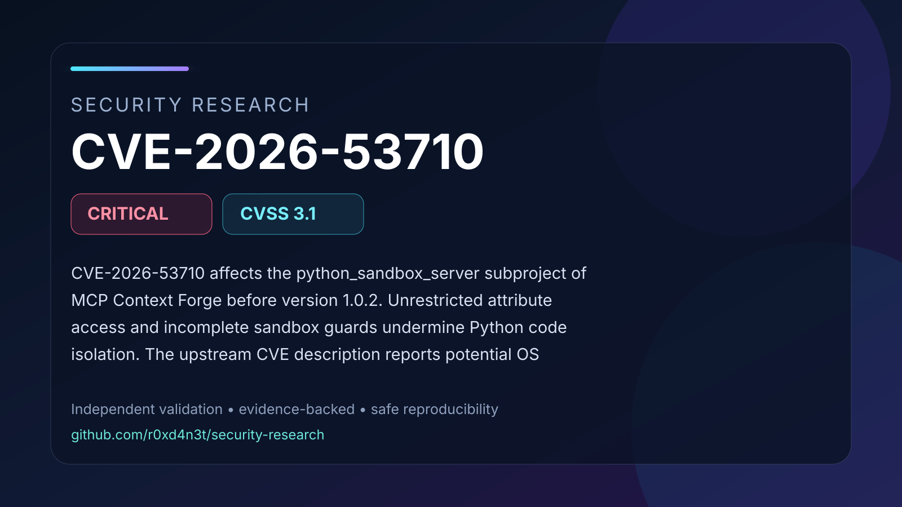

# CVE-2026-53710: Python sandbox isolation weakness in MCP Context Forge

CVE-2026-53710 affects the python_sandbox_server subproject of MCP Context Forge before version 1.0.2. Unrestricted attribute access and incomplete sandbox guards undermine Python code isolation. The upstream CVE description reports potential OS command execution through the execute_code tool. Laboratory control results establish a vulnerable-versus-patched configuration difference; runtime sandbox escape and command execution remain unverified. The core gateway and proxy components are not directly affected.

## Contents

- [Full advisory](ADVISORY.md)
- [Visual summary](images/cover.svg)
- [Validation snapshot](images/validation.svg)
- [Safe PoC validator](poc/README.md)
- [Validation evidence](evidence/validation-summary.json)
- [Source comparison evidence](evidence/source/)
- [References](REFERENCES.md)

## Validation status

The documented vulnerability primitive was validated in an isolated laboratory
using affected and patched controls. Conclusions are limited to behavior
supported by the retained evidence and cited upstream references.
