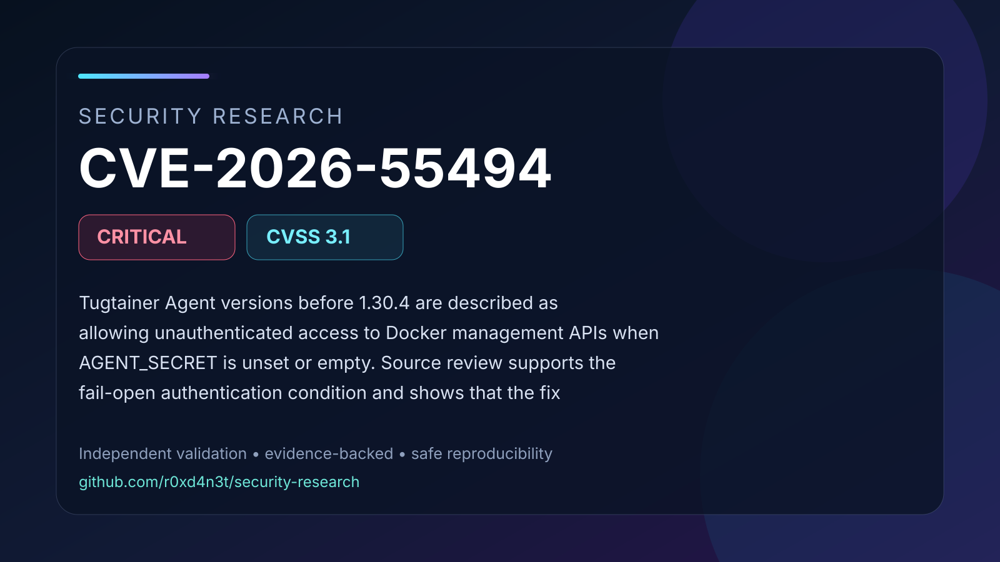

# CVE-2026-55494: Tugtainer Agent authentication bypass when AGENT_SECRET is unset

Tugtainer Agent versions before 1.30.4 are described as allowing unauthenticated access to Docker management APIs when AGENT_SECRET is unset or empty. Source review supports the fail-open authentication condition and shows that the fix requires signature verification by default. Runtime exploitation was not independently reproduced.

## Contents

- [Full advisory](ADVISORY.md)
- [Visual summary](images/cover.svg)
- [Validation snapshot](images/validation.svg)
- [Safe PoC validator](poc/README.md)
- [Validation evidence](evidence/validation-summary.json)
- [Source comparison evidence](evidence/source/)
- [References](REFERENCES.md)

## Validation status

The documented vulnerability primitive was validated in an isolated laboratory
using affected and patched controls. Conclusions are limited to behavior
supported by the retained evidence and cited upstream references.
