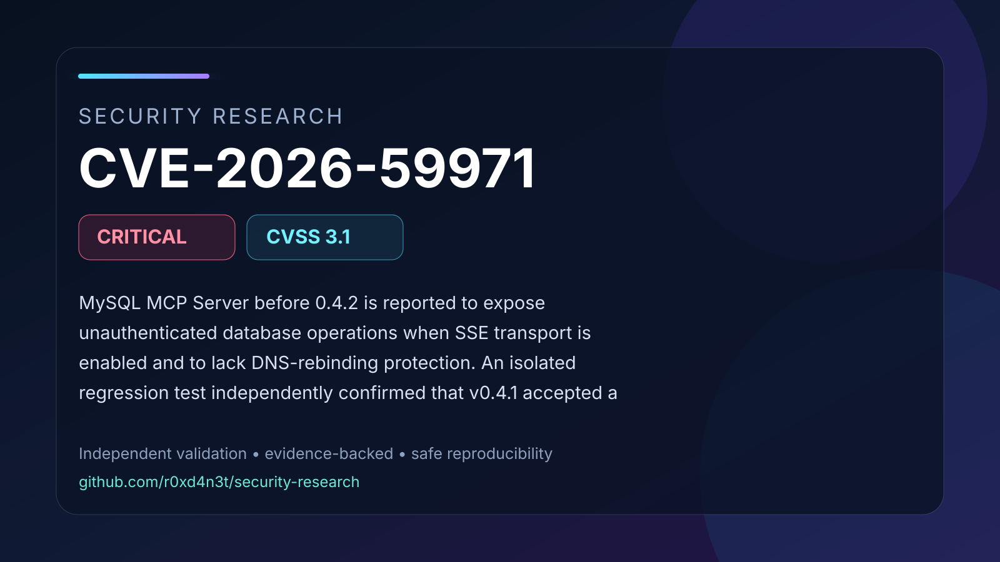

# CVE-2026-59971: MySQL MCP Server SSE transport lacks Host validation

MySQL MCP Server before 0.4.2 is reported to expose unauthenticated database operations when SSE transport is enabled and to lack DNS-rebinding protection. An isolated regression test independently confirmed that v0.4.1 accepted a forged Host value while v0.4.2 rejected it with MCP SDK 1.30.0. This establishes the Host-validation primitive; database access and browser-mediated exploitation were not reproduced. Default stdio transport is reported unaffected.

## Contents

- [Full advisory](ADVISORY.md)
- [Visual summary](images/cover.svg)
- [Validation snapshot](images/validation.svg)
- [Safe PoC validator](poc/README.md)
- [Validation evidence](evidence/validation-summary.json)
- [Source comparison evidence](evidence/source/)
- [References](REFERENCES.md)

## Validation status

The documented vulnerability primitive was validated in an isolated laboratory
using affected and patched controls. Conclusions are limited to behavior
supported by the retained evidence and cited upstream references.
