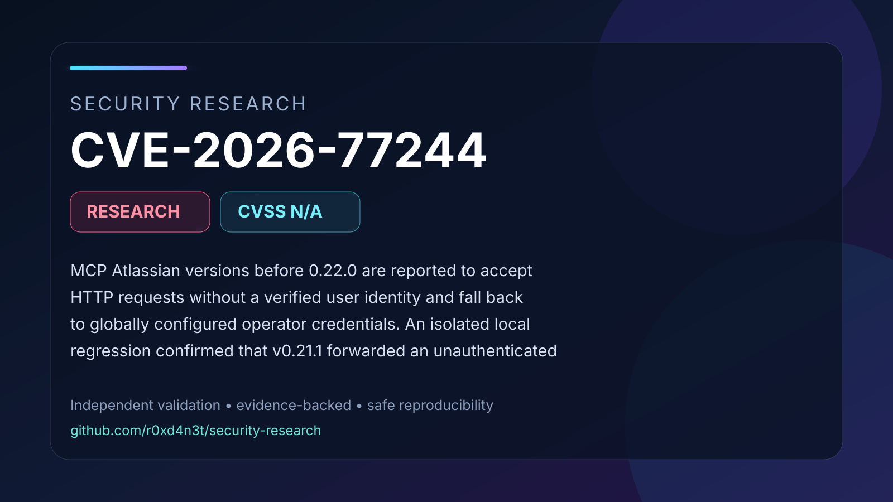

# CVE-2026-77244: Unauthenticated operator-credential fallback in MCP Atlassian

MCP Atlassian versions before 0.22.0 are reported to accept HTTP requests without a verified user identity and fall back to globally configured operator credentials. An isolated local regression confirmed that v0.21.1 forwarded an unauthenticated request to the downstream application and returned a global Jira fetcher in the fallback check. Version 0.22.0 rejected the tested request with HTTP 401 and blocked the fallback. Successful Atlassian read or write operations were not independently demonstrated.

## Contents

- [Full advisory](ADVISORY.md)
- [Visual summary](images/cover.svg)
- [Validation snapshot](images/validation.svg)
- [Safe PoC validator](poc/README.md)
- [Validation evidence](evidence/validation-summary.json)
- [Source comparison evidence](evidence/source/)
- [References](REFERENCES.md)

## Validation status

The documented vulnerability primitive was validated in an isolated laboratory
using affected and patched controls. Conclusions are limited to behavior
supported by the retained evidence and cited upstream references.
