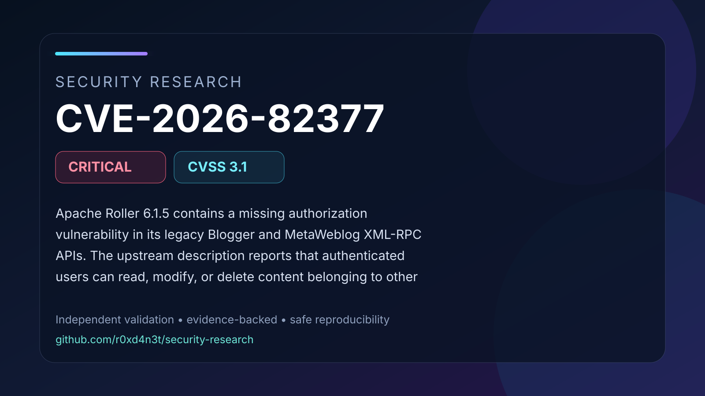

# CVE-2026-82377: Cross-weblog missing authorization in Apache Roller XML-RPC APIs

Apache Roller 6.1.5 contains a missing authorization vulnerability in its legacy Blogger and MetaWeblog XML-RPC APIs. The upstream description reports that authenticated users can read, modify, or delete content belonging to other weblogs when global XML-RPC support is enabled. An isolated local authorization regression test confirmed an authorization failure in 6.1.5 and the expected denial in 6.1.6. The reported severity is Critical, with CVSS v3.1 score 9.9 (CVSS:3.1/AV:N/AC:L/PR:L/UI:N/S:C/C:H/I:H/A:H).

## Contents

- [Full advisory](ADVISORY.md)
- [Visual summary](images/cover.svg)
- [Validation snapshot](images/validation.svg)
- [Safe PoC validator](poc/README.md)
- [Validation evidence](evidence/validation-summary.json)
- [Source comparison evidence](evidence/source/)
- [References](REFERENCES.md)

## Validation status

The documented vulnerability primitive was validated in an isolated laboratory
using affected and patched controls. Conclusions are limited to behavior
supported by the retained evidence and cited upstream references.
