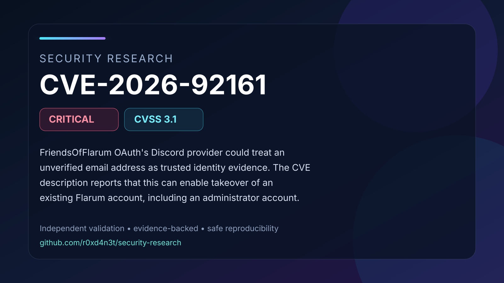

# CVE-2026-92161: Unverified Discord email trusted by FriendsOfFlarum OAuth

FriendsOfFlarum OAuth's Discord provider could treat an unverified email address as trusted identity evidence. The CVE description reports that this can enable takeover of an existing Flarum account, including an administrator account. An isolated regression confirmed the email-trust flaw in fof/oauth 1.7.3 and its correction in 1.7.4. End-to-end account takeover through live Discord authentication remains unverified by this research.

## Contents

- [Full advisory](ADVISORY.md)
- [Visual summary](images/cover.svg)
- [Validation snapshot](images/validation.svg)
- [Safe PoC validator](poc/README.md)
- [Validation evidence](evidence/validation-summary.json)
- [Source comparison evidence](evidence/source/)
- [References](REFERENCES.md)

## Validation status

The documented vulnerability primitive was validated in an isolated laboratory
using affected and patched controls. Conclusions are limited to behavior
supported by the retained evidence and cited upstream references.
